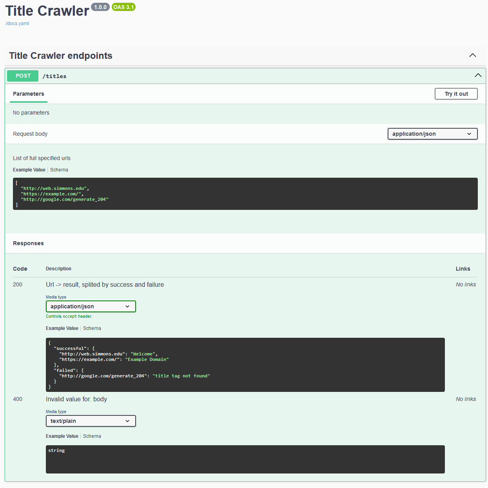

## Title Crawler

**Title Crawler** is a REST API server with http POST endpoint `/titles`.
 Endpoint takes list of urls, and responses with list of `url -> title` and list of `url -> failureMsg`

You can also check swagger documentation generated at http://localhost:8080/docs

```shell
sbt compile # build the project
sbt run # run the application (Main)
```
#### Used libraries:
* cats
* cats-effect
* tapir
* circe
* jsoup

#### Swagger page
